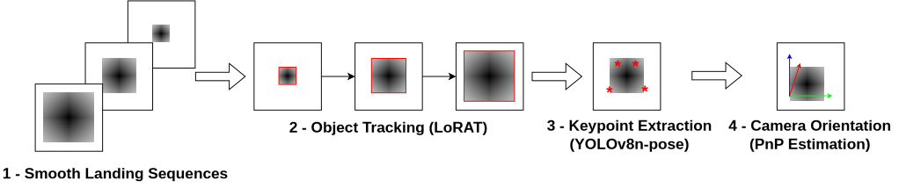

# Vision-based Landing Guidance through Tracking and Orientation Estimation

Official repository for **WACV 2025**: Vision-based Landing Guidance through Tracking and Orientation Estimation.

[[models](https://drive.google.com/drive/folders/1TjAy8daerTkcZs0t0neS6CLAghsvWiVt?usp=sharing)]
[[dataset_sample](https://drive.google.com/file/d/1GZgrXIoXneBC7gbFGC0YXZy84Bd8nI7k/view?usp=sharing)]

|  |
|:--:| 
| *Main steps from our pipeline* |

## Prepare LoRAT environment

When you pull this project, you will also automatically pull the LoRAT project. We made slight changes to a few of their project files to adapt to our dataset. To apply these changes, run `./replace_files.sh` to copy the files from "LoRAT_raplacements" into "LoRAT". Alternatively, you can manually move the files since they are in the same folder structure.

#### Prepare ```LoRAT/consts.yaml```

Adjust ```consts.yaml``` variables for number of workers if required.
```yaml
num_train_workers: 6
num_val_workers: 6
num_eval_workers: 6
num_io_threads_per_worker: 1
on_shared_file_system: false
```

## Prerequisites

### Docker

A Docker image is provided with a functional environment. If you have Docker available and a NVIDIA card with updated drivers, no additional installations are required.

You can find the NVIDIA card mapping in the `docker-compose.yml` file. Notice that you need CUDA installed in your machine for Docker to be able to map the drivers inside the container.

Additionally, we are using the current latest official image for Pytorch and CUDA: `nvcr.io/nvidia/pytorch:24.10-py3`. According to LoRAT documentation, any NGC container with Pytorch >= 2.0 should work, so you can lower the base image version if required.

Once everything is set up, just run:
```shell
docker compose build
```

### Environment

Alternatively, assuming you have a working Python environment with pip installed, install the required dependencies:

#### System Packages (Ubuntu)

```shell
apt update
apt install -y libturbojpeg
```

#### Install Pytorch

PyTorch version should be >= 2.0. Either run the command bellow or follow the tutorial in the [official Pytorch website](https://pytorch.org/).
```shell
pip install torch torchvision
```

#### Install extra python packages from both our project and LoRAT

```shell
pip install -r requirements.txt
pip install -r LoRAT/requirements.txt
```

### Dataset

#### Models

Download our pretrained models from [this link](https://drive.google.com/drive/folders/1TjAy8daerTkcZs0t0neS6CLAghsvWiVt?usp=sharing) and place them under the `models` folder. Structure should be:

```
models
├── keypoints
│   └── model.pt
└── tracking
    └── model.bin
```

#### Images

We are fixing the complete dataset link, but for now you can download a sample sequence:

[[dataset_sample](https://drive.google.com/file/d/1GZgrXIoXneBC7gbFGC0YXZy84Bd8nI7k/view?usp=sharing)]

Unzip the files into the `inputs` folder. The paths should be organized as follows:
```
inputs
├── train
│   ├── Sequence_1
│   │   ├── frames
│   │   │   ├── 0001.jpg
│   │   │   ├── 0002.jpg
│   │   │   ...
│   │   ├── groundtruth.txt
│   ├── Sequence_2
│   │   ...
│   ├── Sequence_N
├── val
│   ├── Sequence_1
│   ...
└── test
    ├── Sequence_1
    ...
```

For the sample sequence, you may simply place in under `inputs/CYUL_06L_35`. Notice that we need the object bounding box for the first frame, it must be placed in the first line of the `groundtruth.txt` file, in the format (X0, Y0, X1, Y1). You do not need the complete ground truth bounding boxes, unless you want to calculate the metrics for the whole sequence.

You can also change the format for the ground truth to (X, Y, W, H), but you will need to change the line `constructor.set_bounding_box_format('XYXY')` from file `LoRAT\trackit\datasets\SOT\datasets\MyDataset.py` to:

```constructor.set_bounding_box_format('XYWH')```

#### Output

Output will be available on `outputs/sequence_name/sequence_name.csv`, and will have one row for each frame, containing the angles and distance for each frame of the current sequence.

## Training

Coming soon!

## Evaluation

Parameters:

- **--input_dir**: currently, the only parameter is the sequence name. Once the sequences are present in the `inputs` folder. Example: `CYUL_06L_35`
<!-- - **Tracking results** are saved in ```/path/to/output/run_id/eval/epoch_{last}/```. -->

### Using Docker (NVIDIA GPU)

Change the argument inside `docker-compose.yml` for your sequence:

`command: python /workdir/main.py --input_dir sequence_name`

Then, simply run:

```shell
docker-compose up
```

Optionally, to debug inside the Docker, change the command line to:

`command: python -m debugpy --wait-for-client --listen ${SERVER_HOST}:${DEBUG_PORT} /workdir/main.py --input_dir sequence_name`

Also, if you are using VSCode, change the `launch.json` file for the `launch_debug.json` file.

### Call main.py directly

Simply call `main.py`:

```shell
python main.py --input_dir sequence_name
```

Note: If you encounter any issues with torch.compile within the LoRAT code, add the following argument to line 51 of `LoRAT/main_remodeled.py`: ```disable_torch_compile```:

```args.mixin_config = ["evaluation", "my_dataset_test", "disable_torch_compile"]```

## Change Dataset Parameters

To change the dataset parameters for the LoRAT algorithm, please follow [their tutorial](https://github.com/LitingLin/LoRAT/blob/main/DATASET.md) on how to create a custom dataset for training and evaluation.

## Citation

```bibtex
@inproceedings{vision-landing,
  title={Vision-based Landing Guidance through Tracking and Orientation Estimation},
  author={J. P. K. Ferreira, J. P. L. Pinto, J. S. Moura, Y. Li, C. L. Castro, & P. Angelov},
  booktitle={WACV},
  year={2025}
}
```

## TODO List

- Add individual readmes for each part of the pipeline
- Improve arguments for Evaluation
- Add training code
- Add complete dataset link
